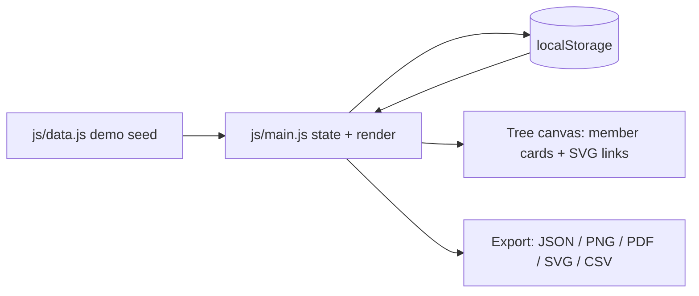

<div align="center">

# The Family Tree Project

**Build, edit, and export a family tree, entirely in the browser.**

[](LICENSE)
[](https://github.com/TechCabana/the-family-tree-project)
[](#)
[](https://github.com/TechCabana/the-family-tree-project/commits/main)

[Live site](https://techcabana.github.io/the-family-tree-project/) ·
[Overview](#overview) ·
[Installation](#installation) ·
[Architecture](#architecture) ·
[Contributing & Licence](#contributing--licence)

</div>

---

> **TL;DR**: The Family Tree Project is a client-side app for building, editing, and exporting a family tree. There is no backend and no build step; everything runs in the browser and saves to `localStorage`.

## Overview

| | |
| --- | --- |
| **Status** | Active |
| **Stack** | Vanilla HTML, CSS, and JavaScript (ES modules); no framework, no build step |
| **Hosting** | GitHub Pages |
| **License** | MIT |
| **Live** | [techcabana.github.io/the-family-tree-project](https://techcabana.github.io/the-family-tree-project/) |

### Goal

The project set out to make it easy to sketch a family tree online without an account, a server, or dedicated software: open the page, add people, and the tree draws and saves itself in the browser. It also served as a from-scratch project for building out front-end and product skills.

**TODO(owner):** confirm whether there's a longer-term plan for this project (more relationship types, shared/multi-device trees, a hosted backend) or whether it's meant to stay a single-device demo indefinitely.

### Scope

| In scope | Not in scope |
| --- | --- |
| Adding, editing, and positioning family members and their relationships (parent, spouse, partner, sibling) | User accounts or authentication |
| Filtering by tag, family side, generation, role, link, and status | Syncing a tree across devices or browsers |
| Exporting the tree as JSON, PNG, PDF, SVG, or CSV, and re-importing a JSON export | Server-side storage; all data lives in the browser's `localStorage` |

---

## Installation

### Prerequisites

| Requirement | Version | Notes |
| --- | --- | --- |
| A modern browser | any current version | The only runtime the app needs |
| A static file server | any | `js/main.js` loads as an ES module (`type="module"`), which browsers block when the page is opened directly via `file://`. The folder has to be served over http(s). |

### 1. Clone

```bash
git clone https://github.com/TechCabana/the-family-tree-project.git
cd the-family-tree-project
```

### 2. Install

Nothing to install. There's no package manager and no build step; the app is plain HTML, CSS, and JavaScript served as-is.

### 3. Run

```bash
python -m http.server 8080
```

Then open `http://localhost:8080`. Any other static file server (`npx serve`, VS Code's Live Server, etc.) works the same way.

You should see a demo family tree already drawn on the canvas, four generations starting with Robert Johnson and Mary Brown.

### If it does not work

| Symptom | Cause | Fix |
| --- | --- | --- |
| Blank canvas, or a console error about CORS or a module MIME type | `index.html` was opened directly via `file://` instead of served over http | Serve the folder with a static server (step 3) and load it via `http://localhost:...` |
| The tree reverts to the demo data | Browser storage was cleared, or the page is open in a private/incognito window | Re-import a previous export with **Import JSON** in the sidebar |

---

## Architecture

### Tools and technologies


| Layer | Choice | Why this one |
| --- | --- | --- |
| Language | Vanilla JavaScript (ES modules), HTML, CSS | No framework or build step |
| Runtime | Browser only | Everything runs client-side |
| Storage | Browser `localStorage` (key `familyTreeData`) | No backend; a tree lives on the device that created it |
| Hosting | GitHub Pages | Static files, nothing to run server-side |
| Automation | None | No CI configured |
| Testing | None | No test suite in the repo |

### How the pieces fit



<!-- ASCII fallback:
```
  data.js demo seed          main.js (state + render)          tree canvas / export
        │                              │                                │
        └─────────────────────────────>├───────────────────────────────>│
                                  localStorage <───┘
```
-->

### End to end walk-through

1. `index.html` loads `js/main.js` as an ES module, which imports the demo dataset from `js/data.js`.
2. On load, `main.js` checks `localStorage` for a `familyTreeData` key. If it's there, it's used; otherwise the app clones the demo data (`loadDataFromLocalStorage`, `js/main.js:6`).
3. The current members and connections render into `#tree-layout` as draggable cards, with relationship lines drawn on the `#tree-connections` SVG.
4. Editing a person or a relationship opens one of the modal forms (`#edit-modal`, `#relationship-modal`). Saving calls `saveDataToLocalStorage()` (`js/main.js:86`), which persists the change.
5. The **Export Options** menu hands the current tree to `html2canvas`, `jsPDF`, or `html-to-image` (all loaded from CDN in `index.html`) to produce a PNG, PDF, or SVG, or serializes it directly to JSON or CSV.

<details>
<summary><b>Why this approach, and what was rejected</b></summary>

**TODO(owner):** document the reasoning behind the key choices here, plain JavaScript instead of a framework, `localStorage` instead of a backend, and whatever else was weighed and rejected along the way. That context isn't recoverable from the code alone.

</details>

<details>
<summary><b>Data model</b></summary>

```json
{
  "members": [
    { "id": 1, "name": "Robert Johnson", "relationship": "Great Grandfather", "status": "Married", "birthDate": "1925-03-15", "deathDate": "2005-11-20", "generation": 0, "side": "paternal", "tags": ["Military", "Craftsman"], "avatar": null, "description": "Served in WWII." }
  ],
  "connections": [
    { "id": "c1", "members": [1, 2], "link": "Spouse", "type": "Biological", "status": "Married", "note": "Married for 50 years." }
  ]
}
```

| Field | Type | Notes |
| --- | --- | --- |
| `members[].id` | number | Unique per member |
| `members[].name` | string | Full name |
| `members[].relationship` | string | Role label shown on the card (`Father`, `Grandmother`, ...) |
| `members[].status` | string | Relationship status (`Married`, `Single`, ...) |
| `members[].birthDate` / `deathDate` | string (ISO date) or `null` | `deathDate` is `null` while the person is living |
| `members[].generation` | number | Vertical tier used for layout and the generation filter |
| `members[].side` | string | `paternal`, `maternal`, or `ego` |
| `members[].tags` | string[] | Free-form labels shown on the card |
| `members[].avatar` | string or `null` | Data URL of an uploaded photo, or `null` |
| `connections[].members` | [number, number] | The two member ids the connection joins |
| `connections[].link` | string | `Parent`, `Spouse`, `Partner`, or `Sibling` |
| `connections[].type` | string | `Biological`, `Adopted`, or `Step-Relationship` |

</details>

<details>
<summary><b>Project structure</b></summary>

```
the-family-tree-project/
├── index.html          entry point: tree canvas, sidebar controls, edit modals
├── about.html           static About page
├── how-to.html           static user guide
├── css/
│   └── style.css          all styling
├── js/
│   ├── main.js             app state, rendering, editing, export logic
│   └── data.js             demo seed data, used when localStorage is empty
├── assets/
│   ├── leaf.svg             decorative background leaf
│   └── HowTo/               screenshots used by how-to.html
└── LICENSE                MIT license text
```

| Path | Role |
| --- | --- |
| `index.html` | Entry point and app shell |
| `js/main.js` | All application logic: rendering, editing, filtering, export |
| `js/data.js` | Seed data loaded on first run |
| `css/style.css` | Single stylesheet for the whole app |
| `assets/` | Images used by the app and the how-to guide |

</details>

---

## Contributing & Licence

### Contributing

Issues and pull requests are welcome. Open an issue before starting anything large, so the approach can be agreed first. Commits follow [Conventional Commits](https://www.conventionalcommits.org/en/v1.0.0/), and work lands on `main` through a pull request.

### Licence

Released under the MIT licence. The full text is in [LICENSE](LICENSE), and it covers the code in this repository only.

### Credits and third-party terms

- Icons: [Font Awesome](https://fontawesome.com/) (Free tier, loaded from cdnjs)
- Font: [Nunito](https://fonts.google.com/specimen/Nunito), via Google Fonts
- Export: [html2canvas](https://github.com/niklasvh/html2canvas), [jsPDF](https://github.com/parallax/jsPDF), and [html-to-image](https://github.com/bubkoo/html-to-image), all loaded from CDN, each under its own license
- The demo family tree (Robert Johnson and descendants) is fictional and shown only to demonstrate the app

---

<div align="center">

<sub>Built and maintained by <a href="https://github.com/TechCabana">TechCabana</a></sub>

</div>
